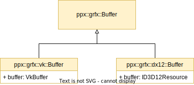

# High-level architecture

## Graphics framework

BigWheels's core is the API-agnostic graphics framework, in the `ppx::grfx` namespace.

The graphics framework exposes graphics types and functionality found in common graphics APIs (buffers, textures, shaders, queues, command buffers, etc.) while abstracting away implementation details.

Currently, the graphics framework supports DirectX 12 and Vulkan.

### API selection and device creation

The graphics API is selected at runtime when the main BigWheels instance (`grfx::Instance`) is created. Once the BigWheels instance object is created, it can be used to create a `grfx::Device` object which will be the main interface to the actual hardware device.

### Resource creation

Graphics resources are not created directly through the classes' constructors, but rather through the `grfx::Device` object, which has `Create` functions for each graphics resource type.

The `Create` functions take in a struct specifying the parameters for the resource being created. For example, the `CreateBuffer` function takes in a `BufferCreateInfo` struct, which defines the desired characteristics for the buffer that needs to be created.

Internally, the device will create and initialize the API-specific object. Each API-specific object (e.g. `VkBuffer`) has a corresponding BigWheels class in which it is encapsulated (e.g. `grfx::vk::Buffer`). That class in turns inherits the generic class exposed to the user (e.g. `grfx::Buffer`). In our buffer creation example, calling `device->CreateBuffer()` when using the Vulkan API will allocate a `grfx::vk::Buffer` object, which in turn will create and initialize a `VkBuffer` object.

The following diagram shows the class hierarchy for a typical API type. There are additional parent classes that deal with resource [ownership](#resource-ownership) and creation that are not shown in the diagram.



Note that there isn't always a 1-to-1 mapping between a BigWheels class and a low-level graphics resource. Rather, there are classes that represent a high level concept that may not have a direct equivalent in a low-level graphics API. Since these classes often just contain and re-use other low-level resources, they do not need to have API-specific code. For example, the `grfx::Model` class represents the typical data required to draw a 3D mesh, and encompasses more than a single resource: it contains a vertex buffer, an index buffer, and textures.

### Resource ownership

The framework handles the lifetime of graphics resources automatically, with most resources being owned by the `grfx::Device` object and destroyed at device destruction time. When a resource is owned by the device, its ownership is set to `REFERENCE`.

However, certain objects such as render passes internally create sub-resources that they manage explicitly. In that case, the ownership of the sub-objects is set to `EXCLUSIVE`, and their destruction is managed by the parent object.

An application can request to transition the ownership of a resource away from the device by explicitly setting it to `EXCLUSIVE` through the `SetOwnership` function, which every class implements. A common use case for this is, for example, the case where the application wants to manage the lifetime of the underlying geometry data of a `grfx::Model` object.

Finally, some objects have their ownership set to `RESTRICTED`. These objects act like `EXCLUSIVE` objects but cannot be transitioned away from this state.

### Queues and commands

Currently, the framework will create a pre-set (configurable) number of queues of each type at device creation time, and it is not possible to manually create additional queues. Graphics, compute, and transfer queues are supported.

GPU queues can be accessed through the device object by using the `GetGraphicsQueue`, `GetComputeQueue` and `GetTransferQueue` methods. The `grfx::Queue` class exposes the typical functionality of a queue object, including command buffer creation and submission, and fence signaling and waiting. The `grfx::CommandBuffer` class is used to record GPU commands into a queue.

### Shaders, descriptors and shader bindings

In order to easily compile shaders into bytecode that works with both DirectX and Vulkan, shaders are usually written in HLSL and compiled offline into a variety of formats (DXIL for DirectX 12, SPIR-V for Vulkan).

However, D3D12 and Vulkan have significantly different binding models. In order to support both of them through the same interface, BigWheels makes some assumptions. The general binding model exposed by BigWheels follows the Vulkan one, with the concepts of descriptor sets and bindings. The mapping from HLSL is the following:

- The HLSL register number becomes the binding number in BigWheels.
- THe HLSL space number becomes the set number in BigWheels.

In particular, the API does not currently expose the resource type (SRV, UAV, CBV, sampler) as part of the binding, which is a part of the D3D12 binding model.

As a consequence, shaders should be written taking into account that resources that share the same HLSL space and register but have a different resource type cannot be represented in BigWheels.

For example, the following shader bindings cannot be represented in BigWheels:

```c++
Texture2D tex : register(t0, space2); // Register 0, space 2, resource type: SRV
Sampler  samp : register(s0, space2); // Register 0, space 2, resource type: Sampler
```

As a workaround, shaders should be written so that space and registers don't overlap across resource types:

```c++
Texture2D tex : register(t0, space2); // Register 0, space 2, resource type: SRV
Sampler  samp : register(s1, space2); // Register 1, space 2, resource type: Sampler
```

## Applications and utilities

BigWheels has scaffolding to help build cross-platform applications beyond the graphics framework, in the `ppx` namespace.

The platforms currently supported are Windows and Linux.

At the highest level, Bigwheels exposes an `Application` class that applications can inherit from. This class provides facilities such as cross-platform window and device set-up, configuration settings, asset loading, input processing and render loop handling. BigWheels integrates with ImGui to provide a simple, opt-in user interface. There is also support for arbitrary command line options, which are exposed by the `Application` class through the `GetExtraOptions` function. For a quick and easy way to set up parameters that can be adjusted through the UI as well as set by command line options, the BigWheels `Knob` framework can be used.

In addition to the `Application` class, there are a number of utility classes that an application can use, such as geometry, math, image, text drawing and logging utilities.

## Errors and logging

The BigWheels API communicates and handles errors through the `ppx::Result` type. This type is used as a return type for most functions that can fail.

The `PPX_CHECKED_CALL` macro can be used to wrap calls that return a `ppx::Result`. If the returned value is not `SUCCESS`, the error will be logged and the application terminated.

BigWheels provides a logging facility that supports console or file logging, with different verbosity and severity levels. An application can use the `PPX_LOG_*` family of macros to log a message at the specified severity, such as `PPX_LOG_ERROR` or `PPX_LOG_INFO`. For logging of structured data, a CSV file logger that supports arbitrary fields is available through the `CSVFileLog` class.
