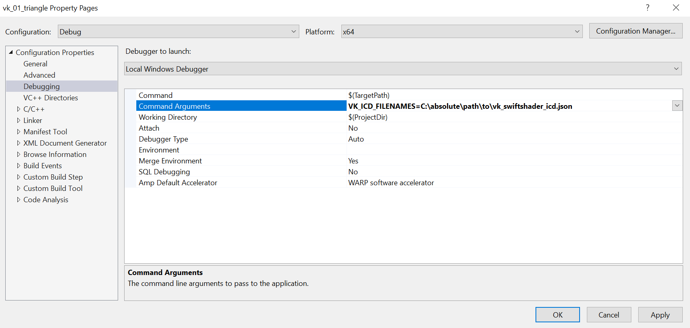

# Software Rendering

If you don't have a compatible GPU, you can use a software renderer to run BigWheels applications. Note that not all features may be supported by the software renderer, and performance will suffer significantly.

## WARP (DirectX)
The [Windows Advanced Rasterization Platform](https://learn.microsoft.com/en-us/windows/win32/direct3darticles/directx-warp) is a software renderer provided by Microsoft as part of the DirectX runtime.

BigWheels supports using WARP as the renderer natively. Simply pass `--use-software-renderer` as a command-line flag to the application and WARP will be selected.

```
bin/bigwheels_application.exe --use-software-renderer
```

## SwiftShader (Vulkan)
BigWheels can use SwiftShader's Vulkan ICD in place of a GPU's ICD using the `VK_ICD_FILENAMES` environment variable, which will instruct the Vulkan loader to load a specific ICD.

Using BigWheels with SwiftShader requires building or obtaining a pre-compiled binary for SwiftShader.

### Building SwiftShader on Windows
```
git clone https://swiftshader.googlesource.com/SwiftShader
cd SwiftShader
mkdir build-vs2019
cmake .. -G "Visual Studio 16 2019" -A x64 -Thost=x64 -DSWIFTSHADER_BUILD_EGL=FALSE -DSWIFTSHADER_BUILD_GLESv2=FALSE -DSWIFTSHADER_BUILD_PVR=FALSE -DSWIFTSHADER_BUILD_TESTS=FALSE -DSWIFTSHADER_WARNINGS_AS_ERRORS=FALSE -DREACTOR_ENABLE_MEMORY_SANITIZER_INSTRUMENTATION=FALSE -DSWIFTSHADER_ENABLE_ASTC=FALSE -DSPIRV_SKIP_EXECUTABLES=TRUE
```
Open `SwiftShader.sln` and build.

The DLL and JSON for the ICD will be located in `build-vs2019/Windows`.

### Building SwiftShader on Linux
```
git clone https://swiftshader.googlesource.com/SwiftShader
cd SwiftShader
mkdir build-make
cd build-make
cmake .. -DSWIFTSHADER_BUILD_EGL=FALSE -DSWIFTSHADER_BUILD_GLESv2=FALSE -DSWIFTSHADER_BUILD_PVR=FALSE -DSWIFTSHADER_BUILD_TESTS=FALSE -DSWIFTSHADER_WARNINGS_AS_ERRORS=FALSE -DREACTOR_ENABLE_MEMORY_SANITIZER_INSTRUMENTATION=FALSE -DSWIFTSHADER_ENABLE_ASTC=FALSE -DSPIRV_SKIP_EXECUTABLES=TRUE
make -j $(nproc)
```
The .so and JSON for the ICD will be located in `build-make/Linux`.

### Using the SwiftShader ICD
The DLL/.so library and JSON manifest can be copied to a different location. Remember to set/export the `VK_ICD_FILENAMES` environment variable before running any of the BigWheels samples.

#### Windows
If you're running the application as a standalone application outside of Visual Studio, set the `VK_ICD_FILENAMES` environment variable before running the application. For example, in PowerShell:
```
$env:VK_ICD_FILENAMES = 'C:\absolute\path\to\vk_swiftshader_icd.json'
bin/bigwheels_application.exe
```

If you are using Visual Studio and running an application through it, add `VK_ICD_FILENAMES=C:\absolute\path\to\vk_swiftshader_icd.json` as an entry to `Configuration Properties -> Debugging -> Environment` in the project's property pages, as shown in the following screenshot.



#### Linux

Set the `VK_ICD_FILENAMES` environment variable before running the application.

```
VK_ICD_FILENAMES=/absolute/path/to/vk_swiftshader_icd.json bin/bigwheels_application
```
