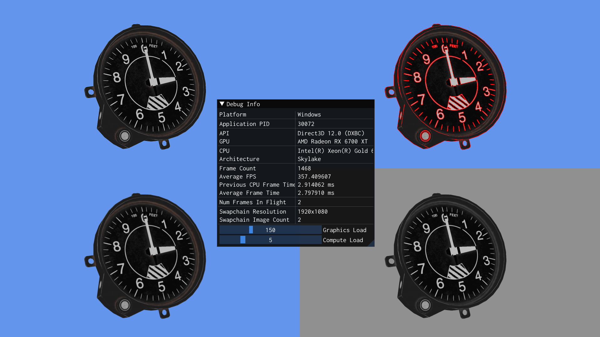
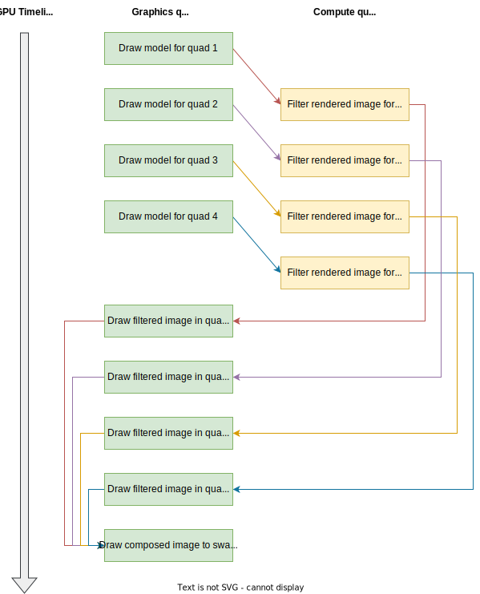
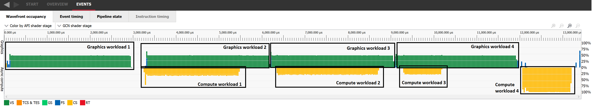

# Async compute

Performs a series of rendering and compute passes, while taking advantage of async compute by allowing the GPU to execute graphics and compute workloads at the same time.

The rendering loop is as follows:

1. The scene (a single model) is rendered four times into four different render targets.
2. Each rendered image is then filtered with a different filter (refer to the [Image Filtering](../image_filter/README.md) project).
3. Each filtered image is then drawn into the final image, where each image occupies one of the four quadrants.
4. The composed image is drawn to screen.

As the following diagram shows, the GPU has the opportunity to schedule compute work that is asynchronous with graphics work. Specifically, the first three filtering steps on the compute queue can run at the same time of the last three rendering steps. On the other hand, the composition steps are not asynchronous.

To confirm whether async compute is happening, you can use a GPU profiler. For example, the AMD [Radeon GPU Profiler](https://gpuopen.com/rgp/) shows async compute workloads:

## Configurability

The ImGui interface exposes two options that can be controlled by the user:

- Graphics load: controls the graphics load by increasing the amount of rendering that the graphics queue performs in the model drawing steps. This does not change the final output, but simply artificially increases load by rendering the model multiple times at the same position.
- Compute load: controls the compute load by increasing the amount of times the image filtering compute shader is run. This does not change the final output, but simply artificially increases load by running the same compute step multiple times.

The project accepts the following command-line options:

- `--enable-async-compute {true|false}` to enable or disable async compute (default: true). Disabling async compute means the compute work is executed synchronously on the same graphics queue where graphics work is scheduled.
- `--use-queue-family-transfers {true|false}` to enable or disable queue family transfer barriers between compute and graphics queues in Vulkan (default: true). Queue family transfer barriers are required by the [spec](https://registry.khronos.org/vulkan/specs/1.3-extensions/html/vkspec.html#synchronization-queue-transfers) for writes and reads between queue families to be well-defined. However, many GPUs and drivers do not technically require these barriers for the program to behave correctly.

## Shaders

Shader                    | Purpose for this project
------------------------- | -------------------------------------------------------------------------------------------------------
`Texture.hlsl`            | Transform and draw the model.
`ImageFilter.hlsl`        | Apply a different filter to each rendered image.
`StaticTexture.hlsl`      | Draw each filtered image into one of the four quadrants of the output image, composing the final image.
`FullScreenTriangle.hlsl` | Draw the composed image to screen.
